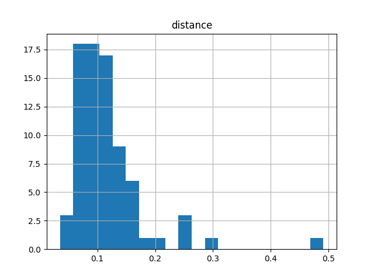
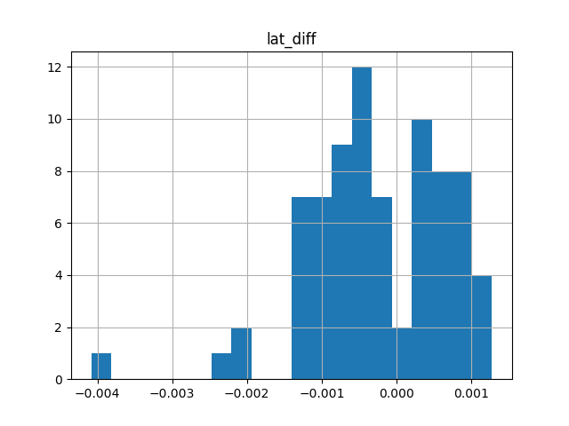
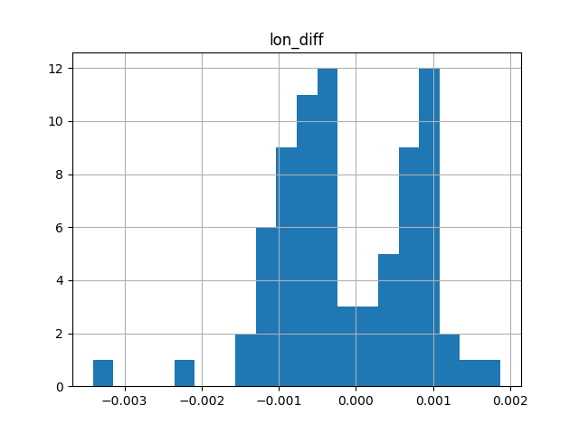

# Address Prediction for AirDNA

### Overview:
AirDNA has a robust model for predicting the AirBNB revenue potential of a property based on AirBNB rates/occupancy at comparable properties nearby.  As they expand into automated property valuation -- how much is a property actually worth, given its AirBNB revenue potential? -- they need address-specific information for AirBNB rentals in order to compare directly with market data, like MLS listings.

### Challenge / Goal:
AirBNB publishes a good deal of information in its listings, but not the address -- you only get an address when you book a stay.  Maps on the AirBNB website show the general vicinity of the property as a circle, not as a point; the actual location of the property is randomized within the circle.  My goal is to 'predict' the addresses by comparing features of AirBNB listings to other data (e.g., from county recorder & tax assessor records), and provide a confidence measure for those predictions.  As a starting point, one can confirm a handful of addresses by looking at properties cross-listed on Homeaway/VRBO -- unlike AirBNB, those services show exact map locations for many properties.

### Datasets:
* AirDNA's proprietary data for Denver, which includes data for most AirBNB listings.
* VRBO data that I scraped, including listing title, latitude, and longitude.

 * Data was scraped by noting that searching by moving the map generates a JSON object, which in turn specifies the updated map.  Iterate through some parameters in the URL for the JSON, and voila, you've got data for the entire city.  See [Ian London's Blog.](https://ianlondon.github.io/blog/web-scraping-discovering-hidden-apis/)


* Similar data from Homeaway, provided by AirDNA.
* Tax assessor data via ATTOM.

### Data processing:
Each data point for training/testing is actually a comparison between an AirBNB property and a property from the tax assessor records.  I only considered 'Entire Home' AirBNB listings.  Label for each point is 'match' (1) or 'non-match' (0).  Features:
```
Max similarity score of AirBNB Host Name(s) and First Name on Deed
Bedrooms on AirBNB listing
Bedrooms on AirBNB listing - Bedrooms in Assessor Data
Bathrooms on AirBNB listing
Bathrooms on AirBNB listing - Bathrooms in Assessor Data
Difference in latitude (AirBNB minus Tax Assessor)
Difference in longitude (AirBNB minus Tax Assessor)
Swimming pool on AirBNB listing
Swimming pool in tax assessor data
```

* **Positive Class (matches):**

 * I used a fuzzy finder (FuzzyWuzzy) with word ratio scoring to find most similar listing titles between AirBNB and VRBO/Homeaway.  Word ratio scoring penalizes heavily for even minor variations -- we're looking for very similar listings only.  I kept only those items with a word ratio score of 80 or greater.  Out of these ~170 data points, questionable matches will be manually discarded -- the intent is not to predict addresses at this stage, it's to be sure of the locations for the (tiny!) positive class.

 * With these confirmed matches, I reverse-geocoded the latitudes and longitudes from VRBO/Homeaway to obtain street addresses via Google Maps API.  Finally, I matched these addresses in the tax assessor data, and determined the model features.

    * Approximately 20% of the VRBO/Homeaway addresses could not be matched to an address in the tax assessor data.  Perhaps the public records are incomplete, or the the location was fudged on the VRBO/Homeaway listing.  Ideally, this discrepancy would be resolved or explained.


* **Negative Class (non-matches):**

 * I pulled every property within 500m of one of the matches (positive class) in the tax assessor data, then determined the model features by comparison to the known AirBNB property.  This generated hundreds of non-matches (negative class) for every match.

### Exploratory Data Analysis:

##### Distance (km) between center of circle and true address:



##### Latitude difference -- center of circle to true address:



##### Longitude difference -- center of circle to true address:



### Model Selection:

* Given the severely imbalanced classes, I'll favor recall over precision, much like fraud detection: even if we have ten false positives for every true positive, we've turned this needle-in-a-haystack problem in to one that could be solved reasonably via human review.

* Ideally, the models will be benchmarked via profit curves, with an AirDNA estimate of the profit potential, and cost being based on Mechanical Turk cost to review each case that was predicted positive (match).

* Try random forest, SVMs, and boosting to classify correct matches (positive) vs. bad matches (negative).

* Experiment with blagging, and possibly additional bagged models generated from balanced bootstrap samples.  Discussion of these methods [here][IC1].

* Experiment with anomaly detection and more exotic algorithms for handling imbalanced data.

## Resources and References:

#### Predicting address from property features/description
* None found...

#### Scraping:
* https://ianlondon.github.io/blog/web-scraping-discovering-hidden-apis/
* http://www.verginer.eu/blog/web-scraping-airbnb/
* https://github.com/tomslee/airbnb-data-collection

#### AirBNB-related news:
* https://motherboard.vice.com/en_us/article/airbnbs-in-a-hot-legal-mess-with-new-york-and-its-not-going-away

#### Imbalanced Classes:
* [Fantastic overview by Tom Fawcett][IC1] -- clearly written, well-visualized, and includes some useful references and jupyter notebook examples!

* [“Class Imbalance, Redux”][IC2]. Wallace, Small, Brodley and Trikalinos. IEEE Conf on Data Mining, 2011.
 * Strong theoretical and empirical justification for undersampling and bagging when facing imbalanced classes.

[IC1]: https://svds.com/learning-imbalanced-classes/#ref6 "Tom Fawcett's Blog"
[IC2]: https://pdfs.semanticscholar.org/a8ef/5a810099178b70d1490a4e6fc4426b642cde.pdf
