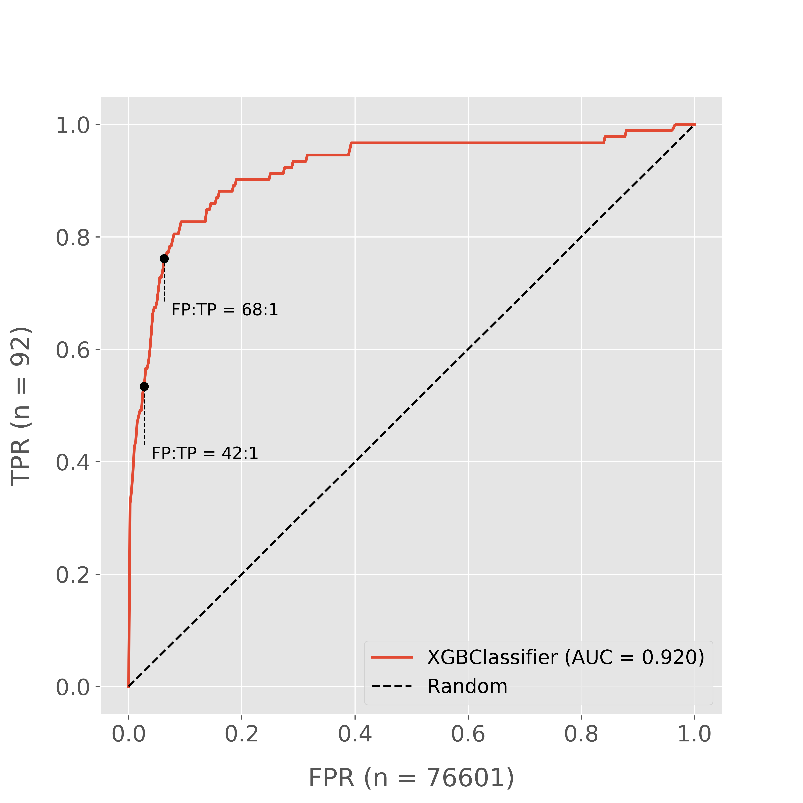

# Address Prediction for AirDNA

### Overview
This project aims to find the exact address of AirBNB listings, or at least, to sufficiently narrow the pool of potential candidates that the problem becomes tractable through a secondary, possibly manual, process.  Why?  AirDNA has an automated valuation model, ['The Rentalizer'](https://www.airdna.co/rentalizer), that forecasts the revenue potential of a property if it were used as a full-time AirBNB rental.  It currently looks at three nearby properties as 'comps' to provide the forecast, but this method leaves a lot uncertain because it relies only on the information in the AirBNB listing!  AirBNB hosts fudge the numbers for bedrooms and bathrooms; we can't be sure of the square footage, age of the house, size of the yard, proximity to a busy street, etc.  We would feel much more confident in that revenue forecast if it were benchmarked against more reliable property information -- say, from public Tax Assessor records.  And in order to find the correct record, we need the correct address.

### Challenge / Goal
AirBNB publishes some basic information in its listings, but not the address -- you only get an address when you book a stay.  Maps on the AirBNB website show the general vicinity of the property as a circle (see below), not as a point; the actual location of the property is randomized within the circle.  In the case of my Denver dataset, this 500m-radius circle contained an average of 833 properties.  For any given AirBNB listing, only one of those 833 properties correctly matches the listing!  My goal is to 'predict' the addresses by comparing features of AirBNB listings to other data (e.g., from public tax assessor records), and provide a cost-benefit framework for analyzing the results.  As a starting point, we can confirm a handful of AirBNB addresses by looking at properties cross-listed on Homeaway/VRBO -- unlike AirBNB, these services show exact map locations for many properties.


### Datasets & Data Collection
* AirDNA's proprietary data for Denver, which includes data for most AirBNB listings.
* VRBO data that I scraped, including listing title, latitude, and longitude.  VRBO (Vacation Rental By Owner) is a service similar to AirBNB.

 * VRBO scraping: searching by moving the map on VRBO.com generates a JSON object, which in turn specifies the updated map.  Iterate through some parameters in the URL to generate JSON objects for properties progressively further from downtown, and you've got listing data for the entire city. See [Ian London's Blog.](https://ianlondon.github.io/blog/web-scraping-discovering-hidden-apis/)

* Similar data from Homeaway (VRBO's parent company), provided by AirDNA.
* Tax assessor records for Denver.

### Data Processing
Each data point for training/testing is actually a comparison between an AirBNB property and a property from the tax assessor records.  I only considered 'Entire Home' AirBNB listings; private and shared room listings often list 1 bed, 1 bath, regardless of house size.  I classify each data point as a 'match' (1) or a 'non-match' (0).  I considered the following features; in the final models, only those marked with an asterisk are included as features.
```
Number of 'neighbors' in radius*
Has unit number
Air conditioning in both AirBNB and Tax Assessor data (henceforth 'in both datasets')
Heating in both both datasets
Indoor fireplace in both datasets*
Pets, elevator, pool, gym in AirBNB data
Max similarity scores of AirBNB Host Name(s) with PartyOwner (1 & 2) first names via WhosWho package*
Bedrooms on AirBNB listing*
Bedrooms on AirBNB listing - Bedrooms in Assessor Data*
Bathrooms on AirBNB listing*
Bathrooms on AirBNB listing - Bathrooms in Assessor Data*
Difference in latitude (AirBNB minus Tax Assessor)*
Difference in longitude (AirBNB minus Tax Assessor)*
Swimming pool on AirBNB listing
Swimming pool in tax assessor data
```

**Positive Class (matches):**

 * I use a fuzzy finder (FuzzyWuzzy) with word ratio scoring to find the most similar listing 'titles' present in both the AirBNB and VRBO/Homeaway data.  Word ratio scoring penalizes heavily for even minor variations -- useful in this context, since I'm looking for very similar listings only.  I keep only those pairs of records with a word ratio score of 50 or better.

 * Out of these 429 data points with similar titles, many are automatically discarded via reverse geocoding -- incorrect matches will tend to lie outside of the 500m circle (with a few exceptions).  After applying the geographical constraint, the remaining matches are manually validated by comparing their AirBNB and VRBO/Homeaway URLs.  The intent at this stage is not to predict addresses; it's to be absolutely sure of the locations for the (tiny!) positive class.  Absent a better method for getting 100% accurate address matches to AirBNB, manual validation is essential here.  Hopefully, mandatory short term rental licensing will eventually make this step easier, at least in some cities/counties.

    * Reverse geocoding was performed with Google Maps API, using the latitude and longitude provided in the Tax Assessor records. 

 * Next, I match these confirmed locations to addresses in the tax assessor data.

    * Approximately 15% of the VRBO/Homeaway addresses cannot be matched to an address in the tax assessor data, even without the 500m proximity restriction.  In some cases, the location has been fudged on the VRBO/Homeaway listing to show a nearby business, not a residence.  In others, it appears that a valid address is simply missing from the tax assessor data.  A better understanding of these discrepancies will be necessary for a deployed model.

**Negative Class (non-matches):**

 * I keep every property in the tax assessor data located within 500m of one of the matches.  This generates hundreds of non-matched (negative class) examples for every match; an average of 833 'non-matches' per match!

#### An interesting discovery -- distances of the true addresses from the center of the circle (in meters):


Distance from the center of the circle is clearly not distributed uniformly within the 500m radius.  This is a promising model feature.

### Model Selection

* Given the severely imbalanced classes, I favor recall over precision (at least to a point), essentially mimicking fraud detection: even if I have many false positives for every true positive, I've turned a needle-in-a-haystack (1-in-833) problem into a problem that could be reasonably and affordably solved by manual process.  An initial attempt at a manual process (no modeling involved) by AirDNA identified 30% of properties in a sample, so we'll treat 30% as the baseline for recall.  ROC and profit curves will be crucial for fine-tuning, as slight increases in recall may result in large decreases in precision.

* Random Forest, SVMs, and Gaussian Naive Bayes were ineffective, even with random over- and undersampling, SMOTE, Tomek Link removal, ENN, and combinations thereof.  The best AUC achieved was .78.

* AdaBoost was better, with AUC ranging from .85 to .9 depending on hyperparameters and under/over-sampling techniques.

* Outlier detection: Isolation Forest and Elliptic Envelope were ineffective.  It appears that most of the matches are not outliers, but that Blagging and XGBoost successfully identify a subset of the data where the matches are most likely to occur.

* XGBoost and Blagging (balanced-bootstrap + bagging; specifically, Balanced Random Forest) were the best models, with AUC approaching .92.  Discussion of Blagging and other methods for imbalanced classes can be found [here][IC1].

* Stacking XGBoost with Blagging did not improve model performance.

### Analysis of Best Models:

#### ROC Curves: Blagging (Balanced Random Forest) and XGBoost


Note that performance is nearly identical up to ~75% recall.  Let's analyze the XGBoost model in-depth:

#### True Positive to False Positive ratios: XGBoost


I've plotted points corresponding to two False-Positive/True-Positive ratios above.  Note that the 42:1 ratio gets us better than 50% recall, but we must accept a significant increase in the ratio (68:1) to surpass 75% recall.  Clearly, the model is much better than random, and either benchmark represents a model threshold that discards over 90% of the negative class.  However, the ultimate proportion of addresses identified will depend on a different process, and if that process is manual (say, comparing photos), its cost will be crucial in determining what false-to-true-positive ratio we can accept.


## Resources and References

#### AirDNA:
* https://www.airdna.co
* Data methodology overview: https://www.airdna.co/methodology
* Rentalizer Automated Valuation: https://www.airdna.co/rentalizer

#### Scraping:
* https://ianlondon.github.io/blog/web-scraping-discovering-hidden-apis/
* http://www.verginer.eu/blog/web-scraping-airbnb/
* https://github.com/tomslee/airbnb-data-collection

#### Imbalanced Classes:
* [Fantastic overview by Tom Fawcett][IC1] -- clearly written, well-visualized, and includes some useful references and jupyter notebook examples.

* [“Class Imbalance, Redux”][IC2]. Wallace, Small, Brodley and Trikalinos. IEEE Conf on Data Mining, 2011.  A strong theoretical and empirical justification for undersampling and bagging in imbalanced-class problems.

#### Profit Curves:
* https://github.com/SydneyLauren/Profit-curves-and-xkcd-plotting/blob/master/Profit_Curves.ipynb
* Galvanize DSI solutions repo

#### AirBNB-related news:
* https://motherboard.vice.com/en_us/article/airbnbs-in-a-hot-legal-mess-with-new-york-and-its-not-going-away

[IC1]: https://svds.com/learning-imbalanced-classes/#ref6 "Tom Fawcett's Blog"
[IC2]: https://pdfs.semanticscholar.org/a8ef/5a810099178b70d1490a4e6fc4426b642cde.pdf
